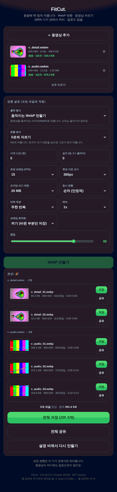

# FitCut

**용량에 딱 맞게 자릅니다.** 동영상을 움직이는 WebP로 바꾸거나 그냥 잘라내되,
정해둔 용량 제한에 맞춰 알아서 여러 조각으로 나눠줍니다. 전부 브라우저 안에서.

[**▶ FitCut 열기**](https://rmdkdkr-png.github.io/fitcut/) &nbsp;·&nbsp;
[English README](README.md)

---

## 왜 만들었나

올리는 곳마다 파일 용량 제한이 있습니다. 디스코드, 게시판, 메신저, 위키. 그런데 기존 변환기들은
40MB짜리를 툭 던져주고 끝이거나, 몇 초로 잘라야 제한에 들어갈지 사람이 계산해서 다섯 번 돌리게 만듭니다.

FitCut은 그 제한을 **입력값으로** 받습니다. "조각당 20MB"라고 정해두면 필요한 만큼 알아서 나눠서,
모든 조각이 제한 안에 들어가게 만듭니다.

전부 브라우저 안에서 처리됩니다. 업로드 없음, 서버 없음, 원본 용량 제한 없음, 대기열 없음.
HTML 파일 하나에 빌드 과정도 외부 라이브러리도 없어서, 저장해두면 인터넷 없이도 돌아갑니다.

## 기능

**움직이는 WebP**
- **최대 60fps**, 조각당 최대 1200프레임
- **용량 기준 자동 분할** — 제한을 넘기 직전에 끊고 다음 조각을 시작합니다
- 고정 길이(5/10/15/20/30/60초)로 자르거나, 아예 안 자를 수도 있습니다
- **프레임 최적화** — 바뀐 사각형만 저장해서 최대 76% 작아집니다
- 여러 파일 한번에, 순차 또는 2~3개 동시 변환
- 원본 fps와 목표 fps가 달라도 재생 타이밍이 정확히 유지됩니다

**동영상 자르기**
- **소리를 포함한 mp4**로 잘라냅니다 (지원 안 되면 webm)
- 분할 규칙은 동일 — 용량 기준, 고정 길이, 또는 한 덩어리
- 배속 지원 (2배속이면 처리 시간도 절반)
- 실제 기록 속도를 재서 다음 조각 길이를 계속 보정합니다

**공통**
- 용량 제한 직접 입력 (0.1MB 단위까지)
- 조각별 미리보기·저장·공유, **전체 저장**은 ZIP으로 묶어줍니다
- 취소하거나 오류가 나도 그때까지 만든 조각은 남습니다
- 변환 중 화면 꺼짐 방지, 다른 탭으로 가면 자동 일시정지 후 복귀

## 성능 측정

헤드리스 Chromium 컨테이너에서 측정했습니다. 휴대폰 기준이 아니니 시간은 상대적으로 보세요.

**프레임 최적화** — 5초, 480×270, 10fps, 품질 80, 배경이 복잡하고 일부만 움직이는 영상:

| | 파일 크기 | 화질(PSNR) |
|---|---:|---:|
| 최적화 끔 | 477 KB | 26.97 dB |
| **최적화 켬** | **113 KB** (−76 %) | 26.94 dB |
| ffmpeg `libwebp_anim` (참고) | 142 KB | — |

화질 손실 0.03dB, 사실상 없습니다. 화면 전체가 계속 바뀌는 영상은 절감이 적습니다(3~15%).

**처리량**

| 작업 | 결과 |
|---|---|
| 25초 원본 → 60fps, 480px, 20MB 제한 | 2조각(20초 + 5초), 처리 25초 |
| 70초 720p → 60fps, 480px, 20MB 제한 | 4조각으로 70초 전부 커버, 합계 11.6MB, 처리 70초 |
| 1280px 30fps 10초 | 최적화 켬 17.6초 / 끔 18.6초 |

## 사용법

셋 다 똑같이 동작합니다.

1. **웹에서** — [데모 열기](https://YOUR_USERNAME.github.io/fitcut/)
2. **로컬에서** — `index.html` 받아서 Chrome으로 열기. 인터넷 없어도 됩니다.
3. **앱처럼** — 안드로이드 Chrome에서 열고 메뉴 → *홈 화면에 추가*

동영상을 넣고, 용량 제한을 정하고, 버튼을 누르면 끝입니다.

## 브라우저 지원

| | 움직이는 WebP | 동영상 자르기 |
|---|---|---|
| Chrome / Edge (데스크톱, 안드로이드) | ✅ | ✅ |
| 삼성 인터넷 | ✅ | ✅ |
| Firefox | ✅ | ⚠️ webm으로 저장 |
| Safari / iOS | ⚠️ 시킹 방식으로 동작, 느림 | ❌ |

WebP 인코딩은 `canvas.toBlob('image/webp')`, 동영상 자르기는 `MediaRecorder` + `captureStream`에
의존합니다. 없는 기능은 감지해서 대체 방식으로 넘어가거나 안내합니다.

## 작동 방식

**프레임 수집.** 한 프레임씩 시킹하면 1200프레임에 몇 분씩 걸립니다. 그래서 영상을 한 번 재생하면서
`requestVideoFrameCallback`으로 프레임을 받습니다. 이 API는 표시된 프레임의 정확한 `mediaTime`을
알려줍니다. 인코딩은 `OffscreenCanvas`를 쓰는 Web Worker 여러 개가 병렬로 처리하고, 큐가 밀리면
재생을 스스로 일시정지해서 균형을 맞춥니다. 이 API가 없는 브라우저는 시킹 방식으로 자동 전환됩니다.

**타이밍.** 목표 fps 기준으로 슬롯을 계산합니다. 원본이 30fps인데 60fps를 요청하면 같은 프레임을
복제하지 않고 프레임별 표시 시간을 늘립니다. 덕분에 용량 낭비 없이 타이밍이 정확합니다.

**프레임 최적화.** 직전 프레임과 비교해 바뀐 사각형만 인코딩합니다(매크로블록 경계에 맞춰 16px 단위로
정렬해서 이음매가 안 보이게). ANMF 오프셋으로 얹고 블렌딩·디스포즈는 쓰지 않습니다. 완전히 같은
프레임은 아예 빼고 직전 프레임의 표시 시간을 늘립니다. 화면의 70% 이상이 바뀌면 통째로 넣는 게 더
싸므로 그렇게 합니다.

**분할.** 프레임은 키프레임으로 구분되는 GOP 단위로 모입니다. GOP 하나를 현재 조각에 넣었을 때
용량과 길이 제한을 모두 만족하면 넣고, 아니면 조각을 닫고 그 GOP로 다음 조각을 시작합니다. 조각은
반드시 키프레임에서 시작하므로 **모든 결과 파일이 독립적으로 재생**되고, 용량 보장은 추정이 아니라
정확합니다.

**먹싱.** 애니메이션 WebP 컨테이너(RIFF / VP8X / ANIM / ANMF)를 정지 WebP 프레임들로부터 직접
조립합니다. WASM도 libwebp도 쓰지 않습니다.

**동영상 모드.** `captureStream` + `MediaRecorder`를 쓰되, 오디오는 스피커에 연결하지 않은 Web Audio
그래프로 우회시킵니다. 그래서 처리 중에는 조용하지만 소리는 그대로 녹음됩니다. `MediaRecorder`가
만든 WebM에는 재생 길이 정보가 없어서, 녹화 후 EBML `Info` 요소를 직접 수정해 플레이어가 길이를
제대로 표시하고 탐색할 수 있게 만듭니다.

## 한계

나중에 알게 되는 것보다 미리 말해두는 게 낫습니다.

- **동영상 자르기는 실시간이고 재인코딩합니다.** ffmpeg의 `-c copy`는 즉시·무손실이지만, 그걸
  브라우저에서 하려면 MP4 컨테이너를 직접 파싱해야 해서 넣지 않았습니다.
- **인코더 품질**은 브라우저 canvas의 WebP 인코더에 달려 있습니다. libwebp의 고급 설정은
  자바스크립트에서 못 건드리기 때문에, 같은 용량이면 ffmpeg 쪽이 더 깨끗합니다.
- GIF 출력, 타임라인 스크러버, 자르기·회전 기능은 없습니다.
- 긴 작업은 휴대폰이 뜨거워지고 배터리를 씁니다. 긴 영상은 fps를 낮추세요.

## 기여

이슈와 PR 환영합니다. 파일 하나에 빌드 과정이 없어서, `index.html` 고치고 브라우저로 열면 끝입니다.

## 라이선스

MIT © 2026 dudu
